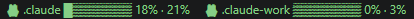
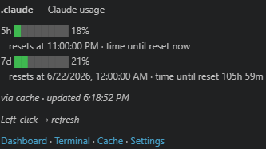
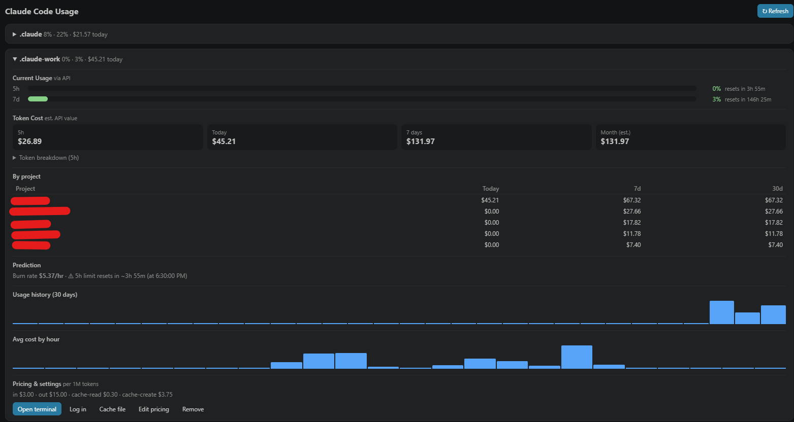
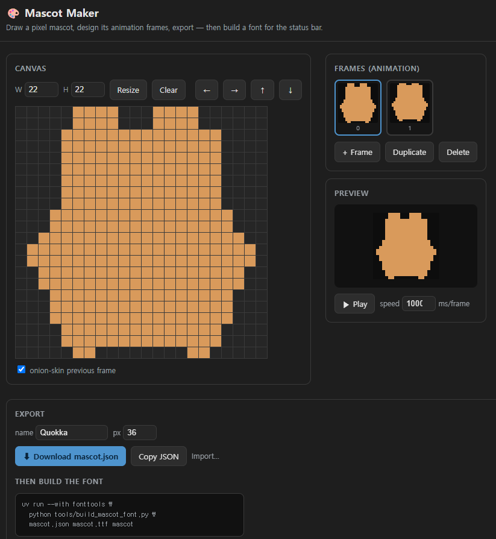

# Claude Multi-Account Usage

[English](README.md) · **한국어**

> Claude Code 사용량과 토큰 비용을 **여러 계정 동시에** — VS Code 상태바에서 항상 보이게.

[](https://marketplace.visualstudio.com/items?itemName=southglory.claude-multi-usage)
[](https://marketplace.visualstudio.com/items?itemName=southglory.claude-multi-usage)
[](https://marketplace.visualstudio.com/items?itemName=southglory.claude-multi-usage)
[](https://open-vsx.org/extension/southglory/claude-multi-usage)
[](https://github.com/southglory/claude-usage-bar/releases)
[](LICENSE)

**여러 계정을 나란히:**



**호버하면 사용량·리셋·빠른 작업:**



**계정별 토큰 비용 대시보드:**



## 개요

**Claude Multi-Account Usage** 는 에디터를 떠나지 않고 Claude Code 사용량을 실시간으로
보여줍니다. 대부분의 상태바 확장은 `~/.claude` 하나만 추적해서, 계정을 둘 이상 쓰면 —
개인·업무 로그인이나 [cc-switch](https://github.com/farion1231/cc-switch) `ccp`/`ccw`
구성 — 나머지는 보이지 않습니다. 이 확장은 **전부** 나란히 보여주고, 터미널에서만 쓰는
계정의 사용량까지 표시합니다.

각 계정의 `projects/` 폴더에서 세션 데이터를 로컬로 읽고(추가 네트워크 호출 없음), 캐시
파일이 없는 계정에 한해 Anthropic API 의 rate-limit 헤더를 조회합니다. 토큰 비용은 모두
설정 가능한 토큰당 단가로 클라이언트에서 계산합니다(기본값: Claude Sonnet 4.x 가격).

> [!NOTE]
> **API 호출은 최소한이며, 안 쓰면 멈춥니다.** 로컬 캐시가 없는 계정의 rate-limit 조회는
> **최대 5분에 한 번**, 그리고 첫 조회 이후에는 그 계정의 세션 로그가 해당 구간 안에
> 갱신됐을 때만 호출합니다 — 즉 Claude Code 를 그만 쓰면 API 호출도 멈춥니다. 한 번 호출은
> 약 1토큰짜리 `claude-haiku-4-5` 요청(≈ **$0.0001**)이고, 보통 월 **$0.01 미만**입니다.
> `claudeMultiUsage.fetchUsageViaApi: false` 로 두면 API 호출을 전혀 안 합니다(캐시 전용).
> 주기는 `claudeMultiUsage.apiMinIntervalSeconds` 로 조절합니다.

> [!WARNING]
> **비용은 추정치입니다.** 토큰 수(정확함)의 *API 환산 금액*이지 실제 구독 청구액이 아니며,
> 모든 모델에 한 가지 단가를 적용한 값입니다. 기본값은 작성 시점의 Anthropic Sonnet 공개
> 가격 기준이며, 가격이 바뀌면 [Anthropic 가격 페이지](https://www.anthropic.com/pricing)에
> 맞춰 `claudeMultiUsage.pricing.*` 를 업데이트하세요.

## 기능

- **N개 계정 나란히** — 이름 하드코딩 없음, 개수 제한 없음.
- **자동 탐지** — 목록을 비우면 홈에서 `.claude*` 디렉터리를 찾습니다. 라벨은 **폴더 이름 그대로**(`.claude`, `.claude-work`) — 파싱 없음. 자유롭게 변경 가능.
- **터미널 전용 계정도 지원** — 캐시 파일이 없으면 API 로 사용량을 가져옵니다(개요 참고).
- **두 윈도우 모두 색상 경고** — 초록 → 노랑 → 빨강. 7d 가 가득 차고 5h 가 여유로워도 바가 빨갛게 바뀌며 7d 리셋 카운트다운을 보여줍니다.
- **토큰 비용 대시보드** — 계정별 오늘 지출, 5h/7d 바, 비용 타일(5h / 오늘 / 7일 / 월), 그리고 **Details** 에 5h 토큰 분해·프로젝트별 비용·30일 히스토리 스파크라인·시간대별 평균 비용.
- **계정별 터미널** — 해당 계정의 `CLAUDE_CONFIG_DIR` 을 주입한 Claude 터미널을 엽니다. 전역 전환 없이 동시 실행.
- **cc-switch 호환** — `command: "ccw"` / `"ccp"` 로 기존 래퍼를 그대로 실행.
- **숨쉬는 쿼카 마스코트** — 작은 픽셀 쿼카(끄거나 교체, 또는 [직접 그리기](#나만의-마스코트-만들기)).

## 데이터 소스

계정마다 사용량은 두 소스 중 하나에서(순서대로):

1. **캐시 파일** — `<CLAUDE_CONFIG_DIR>/vscode-claude-status-cache.json`. Claude Code 의 VS Code 통합이 써주지만 **VS Code 가 폴링하는 한 계정**에만 써줍니다 — 터미널 전용 계정엔 없습니다.
2. **API 폴백** (`fetchUsageViaApi`, 기본 켜짐) — 계정의 `.credentials.json` OAuth 토큰으로 `api.anthropic.com` rate-limit 헤더에서 가져옵니다(비용/주기는 위 Note 참고).

토큰 비용은 `projects/**` 세션 로그의 정확한 토큰 수 × 설정 단가로 계산합니다.

## 설치

- **마켓플레이스**: **"Claude Multi-Account Usage"** 검색 또는 `ext install southglory.claude-multi-usage`.
- **VSIX**: [Releases](https://github.com/southglory/claude-usage-bar/releases) 에서 받아 `code --install-extension claude-multi-usage-0.6.0.vsix`.
- **개발 실행**: 폴더를 열고 `F5`.

## 설정 (`settings.json`)

```jsonc
"claudeMultiUsage.accounts": [
  { "label": ".claude",      "dir": "~/.claude" },
  { "label": ".claude-work", "dir": "~/.claude-work" }
  // 라벨은 자유 텍스트 — 원하는 이름으로
],
"claudeMultiUsage.refreshIntervalSeconds": 30,
"claudeMultiUsage.warnAt": 0.5,                // 노란색 임계
"claudeMultiUsage.critAt": 0.9,                // 빨간색 임계
"claudeMultiUsage.show7d": true,
"claudeMultiUsage.fetchUsageViaApi": true,     // 캐시 없는 계정 사용량
"claudeMultiUsage.apiMinIntervalSeconds": 300, // API 조회 최소 간격(5분)
"claudeMultiUsage.pricing.inputPerMillion": 3, // 비용 추정 단가(USD / 1M)
"claudeMultiUsage.clickAction": "refresh"      // refresh | dashboard | launch | openCache
```

`dir` 은 `~`, `%USERPROFILE%`, `${env:VAR}` 를 확장합니다. 자동 탐지는 목록이 비었을 때만
동작합니다. **좌클릭** 은 `clickAction` 을 실행하고, 호버 툴팁에 **Dashboard · Terminal ·
Cache · Settings** 링크가 있습니다(VS Code 가 상태바 항목의 커스텀 우클릭 메뉴를 지원하지
않음).

## 계정 추가 & 첫 로그인

**대시보드**(툴팁 → *Dashboard*)를 열고 **+ Add account** 를 펼쳐 라벨과 config 디렉터리를
입력한 뒤 **Add & log in** — `CLAUDE_CONFIG_DIR` 을 설정한 터미널을 열고 `claude` 를
실행하므로 새 디렉터리면 로그인 화면이 뜹니다. 각 카드에 **Log in**, **Open terminal**,
**Remove** 버튼도 있습니다.

## 계정 전환 (cc-switch 내장)

전역 상태를 건드리지 않고 계정별 터미널을 엽니다:

1. **env 주입(기본)** — `command` 미지정: `CLAUDE_CONFIG_DIR` 주입 후 `launchCommand`(기본 `claude`) 실행.
2. **cc-switch 래퍼** — `command: "ccw"` / `"ccp"`: 그 래퍼를 그대로 실행.

## 단축키

```jsonc
{ "key": "ctrl+alt+1", "command": "claudeMultiUsage.launch", "args": 0 }, // 1번째 계정
{ "key": "ctrl+alt+0", "command": "claudeMultiUsage.launch" }            // 인자 없으면 선택창
```

## 나만의 마스코트 만들기

쿼카가 싫다면 직접 그리세요. 브라우저에서 **`tools/mascot-maker.html`** 을 열면 픽셀
에디터가 나옵니다 — 프레임마다 그리고, 이전 프레임을 어니언 스킨으로 보고, 루프를 미리 봅니다.



`mascot.json` 을 내보낸 뒤 폰트를 빌드합니다:

```sh
uv run --with fonttools python tools/build_mascot_font.py mascot.json mascot.ttf mascot
```

붙여넣을 `contributes.icons` 블록과 `characterFrames` 값을 출력합니다. `mascot.ttf` 를
`package.json` 옆에 두고 다시 패키징하세요.

**한 번에(개발용):** 기본 마스코트에 바로 적용하려면 `--apply` 로 실행하세요(프레임 2개 유지):

```sh
uv run --with fonttools python tools/build_mascot_font.py mascot.json --apply
```

`--apply` 는 **소스** `quokka.ttf` 만 덮어씁니다. 상태바가 실제로 바뀌려면 그 폰트를 쓰는
VS Code 인스턴스가 폰트를 다시 로드해야 합니다:

- **개발(F5 Extension Development Host):** `--apply` 후 그 창을 reload → 끝.
- **설치된 확장:** 설치본은 자기 `quokka.ttf` 복사본을 갖고 있어서, 재패키징 + 재설치도 필요합니다:
  ```sh
  npx @vscode/vsce package && code --install-extension claude-multi-usage-*.vsix --force
  ```
  그 후 reload. 글리프가 캐시된 것처럼 안 바뀌면(같은 `E001`/`E002` 코드포인트), VS Code 를 완전히 **재시작**하세요.

> 왜 편집기 안 "Apply" 버튼이 없나요? 브라우저 페이지는 설치된 확장에 파일을 못 쓰고,
> VS Code 는 아이콘 폰트를 정적으로 로드하기 때문에 픽셀 마스코트는 항상 재패키징이
> 필요합니다. 재빌드 없이 즉시 바꾸려면 `claudeMultiUsage.characterFrames` 에 이모지/
> 코디콘을 넣으세요.

> 픽셀 마스코트는 폰트 번들이 필요합니다. 재패키징 없이 빠르게 바꾸려면
> `claudeMultiUsage.characterFrames` 에 이모지/코디콘을 넣으세요. 예: `["▃","▆"]`.

## 개인정보 & 왜 오픈소스인가

이 확장은 민감한 로컬 파일 — 각 계정의 `.credentials.json` OAuth 토큰 — 을 읽어 사용량을
가져옵니다. 그래서 **일부러 완전 오픈소스**입니다: 말로 믿지 말고 코드를 보세요.

- **토큰은 기기를 떠나지 않습니다.** 본인 사용량을 읽기 위해 **`api.anthropic.com`** 을 직접 호출(Claude Code 가 쓰는 엔드포인트)할 때 외에는요. **제3자 서버·텔레메트리·분석 없음.**
- API 폴백은 **옵트아웃**(`fetchUsageViaApi: false`)이며 호출 빈도가 제한됩니다(Note 참고).
- 각 config 디렉터리에서 읽는 것 전부: `vscode-claude-status-cache.json`, `.credentials.json`, `projects/**` 의 토큰 수.

## 기여

이슈와 PR 환영: <https://github.com/southglory/claude-usage-bar>. 순수 JavaScript(빌드
단계 없음)이고, 마스코트 폰트와 `.vsix` 는 `tools/` 스크립트로 생성됩니다.

---

## 라이선스

[MIT](LICENSE) © southglory — 자유롭게 사용·포크·수정.
